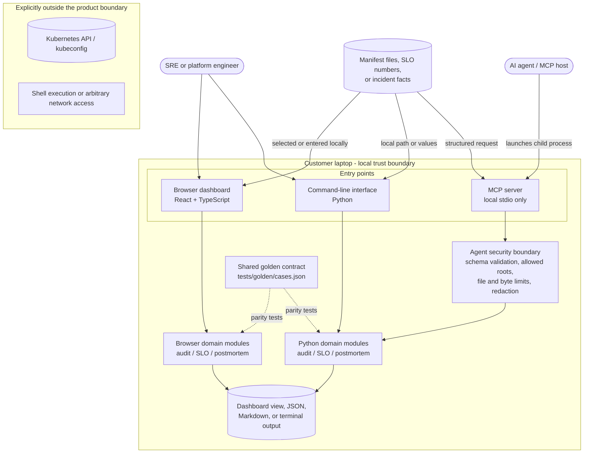

# ReliabilityKit

ReliabilityKit is an early-stage, local-first toolkit for practical Kubernetes
and SRE workflows. Version 0.2 provides one browser dashboard, three matching
command-line tools, and a secure MCP interface for AI agents:

1. **Kubernetes manifest auditor** - finds reliability risks in local YAML and
   JSON manifests without connecting to a cluster.
2. **SLO calculator** - calculates time-based and event-based error budgets.
3. **Postmortem generator** - creates a structured, blameless incident report
   in Markdown.

The tools ask for no cluster credentials. Dashboard inputs are processed in the
browser and are not sent to an application backend.

## Connect an AI agent

Install the optional agent integration:

```powershell
python -m venv .venv
.venv\Scripts\python -m pip install -e ".[agent]"
```

Point an MCP-compatible host at the absolute path to
`.venv\Scripts\reliabilitykit-mcp.exe`. The server runs over local stdio and
opens no network port. Restrict manifest access with
`RELIABILITYKIT_ALLOWED_ROOTS`; resource identifiers are redacted by default.

See [the agent integration guide](docs/AGENT_INTEGRATION.md) for configuration,
tool contracts, and the security boundary.

> [!IMPORTANT]
> ReliabilityKit provides engineering signals, not a security or compliance
> certification. Validate recommendations against each workload's operational
> requirements.

## Run the dashboard

Node.js 22.13 or newer and pnpm are required.

```powershell
cd dashboard
pnpm install
pnpm dev
```

Open `http://localhost:3000`. The dashboard combines the manifest audit, SLO
calculator, and postmortem builder in one responsive interface. It can export
audit and SLO results as JSON and postmortems as Markdown.

Create a deployable production build with:

```powershell
pnpm build
```

The checked-in Sites configuration is intentionally unbound. A hosting
provider can assign its own project identifier during deployment; no personal
account or deployment credential is included in this repository.

## Architecture and workflow

ReliabilityKit deliberately keeps the browser and CLI implementations separate
while holding their results to one shared contract:



The dashboard is client-side: a manifest is parsed and evaluated in the user's
browser. The Python CLI follows the same local-first model for terminals and CI.
Neither workflow needs Kubernetes credentials or an application backend.

How to read the diagram:

- **Human path:** you use either the dashboard or CLI. Both process data on the
  laptop and produce browser, terminal, JSON, or Markdown output.
- **Agent path:** an MCP-compatible host launches `reliabilitykit-mcp` as a
  child process. Requests cross the agent security boundary before reaching the
  existing Python tools.
- **Two implementations, one behavior:** the browser uses TypeScript and the
  CLI/MCP server use Python. Shared golden test cases keep their results aligned.
- **Trust boundary:** there is no Kubernetes API, kubeconfig, shell, or general
  filesystem tool. Agent manifest reads are limited to operator-approved roots.

### Request flow

1. A human or agent chooses the manifest audit, SLO calculator, or postmortem
   builder.
2. The selected interface validates the structured input. Agent manifest paths
   also pass canonical-path, allowed-root, file-count, and byte-size checks.
3. A domain module performs the calculation or analysis without cluster access.
4. The interface returns structured data and optionally renders or downloads
   JSON or Markdown.
5. Shared golden fixtures detect behavior drift between Python and TypeScript.

## Folder structure

```text
reliabilitykit/
├── .github/workflows/ci.yml       # Python and dashboard CI
├── AGENTS.md                       # Safety contract for coding agents
├── dashboard/                     # React/Vinext browser application
│   ├── app/                       # Page, layout, and global visual tokens
│   ├── components/dashboard/      # Three product workflows
│   ├── components/ui/             # Reusable shadcn interface primitives
│   ├── lib/                       # TypeScript audit/SLO/postmortem logic
│   ├── public/                    # Brand and background assets
│   └── tests/                     # Browser-logic golden contract tests
├── docs/                           # Security and agent integration guidance
├── src/reliabilitykit/            # Python package and CLI domain modules
├── tests/                         # Python tests, fixtures, shared contract
├── CHANGELOG.md                   # Version history
├── CONTRIBUTING.md                # Contribution workflow
└── pyproject.toml                 # Python package metadata and CLI entry point
```

## Run the CLI

Python 3.10 or newer is required.

### Windows PowerShell

```powershell
python -m venv .venv
.venv\Scripts\python -m pip install --upgrade pip
.venv\Scripts\python -m pip install -e .
.venv\Scripts\reliabilitykit --help
```

### Linux or macOS

```bash
python3 -m venv .venv
.venv/bin/python -m pip install --upgrade pip
.venv/bin/python -m pip install -e .
.venv/bin/reliabilitykit --help
```

## Tool 1: audit Kubernetes manifests

Audit one file or recursively audit a directory:

```powershell
reliabilitykit audit .\tests\fixtures\risky.yaml
```

Create a JSON report with hashed object names:

```powershell
reliabilitykit audit .\manifests --format json --redact-names --output .\reports\audit.json
```

The auditor currently evaluates:

- Controller-managed workloads versus bare Pods
- Replica count and HPA minimum replicas
- PodDisruptionBudget coverage
- Topology spread or pod anti-affinity
- Deployment strategy
- Readiness and liveness probes
- CPU and memory requests
- Memory limits
- Immutable container image references
- CronJob concurrency policy

By default, the audit command returns exit code `1` when it finds a high or
critical issue. Use `--fail-on medium`, `--fail-on critical`, or
`--fail-on none` to choose the CI threshold.

Secret resources are counted and skipped. Raw manifests, environment values,
logs, and Secret values are never included in a report. See
[the security model](docs/SECURITY_MODEL.md) before using production-derived
manifests.

## Tool 2: calculate an SLO error budget

Calculate the downtime permitted by a 99.9% objective over 30 days:

```powershell
reliabilitykit slo --objective 99.9 --window-days 30
```

Include observed request events:

```powershell
reliabilitykit slo --objective 99.9 --window-days 30 `
  --total-events 1000000 --bad-events 500 --format json
```

## Tool 3: generate a postmortem

```powershell
reliabilitykit postmortem `
  --title "Checkout latency incident" `
  --incident-id "INC-2026-001" `
  --severity "SEV-2" `
  --service "checkout-api" `
  --started "2026-09-13T10:00:00+05:30" `
  --ended "2026-09-13T11:30:00+05:30" `
  --summary "Checkout requests experienced elevated latency." `
  --impact "Ten percent of requests exceeded the latency SLO." `
  --output .\reports\INC-2026-001.md
```

The command refuses to overwrite an existing postmortem.

## Run the tests

Both implementations consume the same golden contract in
`tests/golden/cases.json`. This keeps audit findings, SLO calculations, and
postmortem structure aligned between Python and TypeScript.

```powershell
$env:PYTHONPATH = "src"
.venv\Scripts\python -m unittest discover -s tests -v

cd dashboard
pnpm test
pnpm lint
pnpm build
```

## Product direction

The next planned milestones are:

- A signed, open-source Go collector with narrowly scoped Kubernetes RBAC
- Customer-reviewable, sanitized assessment bundles
- Policy packs and richer remediation guidance
- Optional audit history and team workflows with explicit customer consent
- Optional continuous assessment through an explicitly installed agent

No Oracle code, documentation, credentials, or proprietary implementation is
used in this project.

## License

ReliabilityKit is available under the [MIT License](LICENSE).
